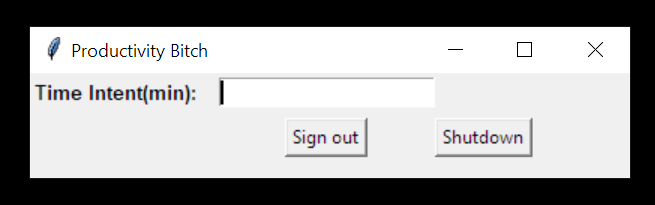
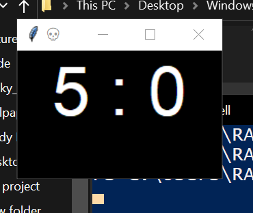

 # Windows-usage-limiter
The program ask for time intended on windows startup and will shutdown/Sign out windows after the set time.  
A counter will appear 3 min before the time runs out.

If you close the countdown or the time intended asking window the timer will run out automatically.  

## How to Run
1. Make sure Python is installed on your pc.
2. set the break.pyw to open with Python.
3. Run the setup.py 
4. Enter windows username(case sensetive).

## How to remove

1. Remove the break.py file from [windows startup folder](https://www.howtogeek.com/208224/how-to-add-programs-files-and-folders-to-system-startup-in-windows-8.1/#:~:text=To%20open%20the%20%E2%80%9CStartup%E2%80%9D%20folder%20the%20easy%20way%2C%20just,to%20the%20%E2%80%9CStartup%E2%80%9D%20folder.).

## Some points
* The program is pretty unstoppable unless u end task python from taskmanager.
* Closing the countdown timer will shutdown windows automatically.
* To dodge the countdown you can sign out of windows and then sign back in.

* You can increase the countdown time by changing the countdown_min in the start of the code.

##
  
  
##

